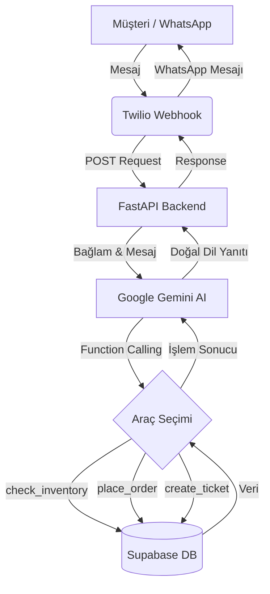

# Omni-Agent 🤖📦

[](https://fastapi.tiangolo.com/)
[](https://reactjs.org/)
[](https://tailwindcss.com/)
[](https://supabase.io/)
[](https://ai.google.dev/)

Omni-Agent, işletmeler için WhatsApp üzerinden gelen müşteri taleplerini **%100 otonom** bir şekilde yöneten, yapay zeka (LLM) destekli bir müşteri ve sipariş yönetim ekosistemidir. 

Geleneksel, kural tabanlı chatbotların aksine Omni-Agent; müşterinin doğal dildeki niyetini anlayan, arka plandaki veritabanıyla etkileşime giren (Function Calling) ve empati kurabilen bir dijital asistandır.

---

## 🌟 Öne Çıkan Özellikler

- **🤖 Otonom Ajan Mimarisi:** Gemini 1.5 Flash modeli ile müşterinin niyetini analiz eder ve otomatik olarak doğru araçları (stok kontrolü, sipariş verme, bilet oluşturma) tetikler.
- **💬 Akıllı WhatsApp Entegrasyonu:** Twilio API üzerinden müşterilerle doğrudan WhatsApp üzerinden iletişim kurar.
- **🧠 Bağlamsal Hafıza (Session Memory):** Supabase entegrasyonu ile geçmiş konuşmaları hatırlar ve müşteriye ismiyle hitap ederek kaldığı yerden devam eder.
- **📊 Gelişmiş Admin Dashboard:** Siparişleri, stok durumunu ve müşteri taleplerini real-time (anlık) olarak takip edebileceğiniz modern bir panel.
- **🎭 Duygu Analizi (Sentiment Analysis):** Müşteri mesajlarındaki öfke veya aciliyet durumunu tespit eder ve "Kritik" etiketli talepler için yöneticileri uyarır.
- **🔐 Güvenli Erişim:** Admin paneli için şifre korumalı giriş ve güvenli session yönetimi.

---

## 🛠️ Teknoloji Yığını

### Backend (Beyin)
- **FastAPI:** Yüksek performanslı, asenkron Python framework.
- **Google Gemini API:** `gemini-1.5-flash` ile anlamsal analiz ve Function Calling.
- **Twilio:** WhatsApp mesajlaşma köprüsü.
- **Supabase (PostgreSQL):** Bulut veritabanı ve Real-time veri akışı.

### Frontend (Yönetim Paneli)
- **React + Vite:** Hızlı ve modüler kullanıcı arayüzü.
- **Tailwind CSS v4:** Modern ve esnek stil yönetimi.
- **Framer Motion:** Akıcı UI animasyonları ve geçişler.
- **Lucide React:** Minimalist ve açıklayıcı ikon seti.

---

## 📐 Sistem Mimarisi



---

## 🚀 Hızlı Başlangıç (Kurulum)

Projeyi yerel ortamınızda ayağa kaldırmak için aşağıdaki adımları izleyin.

### 📋 Gereksinimler
- **Python 3.9+**
- **Node.js 18+**
- **Ngrok** (Webhook'ları yerel sunucuya yönlendirmek için)
- API Anahtarları: [Gemini API](https://aistudio.google.com/), [Twilio](https://www.twilio.com/), [Supabase](https://supabase.com/)

### 1. Depoyu Klonlayın
```bash
git clone https://github.com/tahaaoztrkk/Omni-Agent.git
cd Omni-Agent
```

### 2. Backend Kurulumu
```bash
cd backend
python -m venv venv
source venv/bin/activate  # Windows için: venv\Scripts\activate
pip install -r requirements.txt
```
`backend/.env.example` dosyasını `.env` olarak kopyalayın ve bilgilerinizi girin:
```env
SUPABASE_URL=your_supabase_url
SUPABASE_KEY=your_supabase_anon_key
GEMINI_API_KEY=your_gemini_api_key
```
Sunucuyu başlatın:
```bash
python -m uvicorn main:app --reload --port 8080
```

### 3. Frontend Kurulumu
```bash
cd ../frontend
npm install
```
`frontend/.env.example` dosyasını `.env` olarak kopyalayın:
```env
VITE_SUPABASE_URL=your_supabase_url
VITE_SUPABASE_ANON_KEY=your_supabase_anon_key
VITE_ADMIN_PASSWORD=your_secure_password
```
Dashboard'u başlatın:
```bash
npm run dev
```

### 4. WhatsApp Webhook Bağlantısı (Ngrok)
Twilio'nun yerel backend'inize erişebilmesi için ngrok kullanın:
```bash
ngrok http 8080
```
Ngrok'un sağladığı URL'yi Twilio Console'da **Messaging > Sandbox Settings** altındaki "When a message comes in" kısmına yapıştırın:
`https://your-ngrok-url.ngrok-free.app/api/webhook/whatsapp`

---

## 🗄️ Veritabanı Şeması (Supabase)

Projenin tam performanslı çalışması için Supabase üzerinde aşağıdaki tabloları oluşturun:

| Tablo | Açıklama |
| :--- | :--- |
| `products` | Ürün listesi, stok miktarları ve fiyatlar. |
| `orders` | Müşteri siparişleri ve teslimat durumları. |
| `tickets` | Destek talepleri ve aciliyet seviyeleri. |
| `chat_history` | AI ve müşteri arasındaki konuşma geçmişi (Memory). |

---

## 👥 Geliştiriciler

Bu proje aşağıdaki geliştiriciler tarafından büyük bir tutkuyla inşa edilmiştir:

<table>
  <tr>
    <td align="center">
      <a href="https://github.com/tahaaoztrkk">
        <br />
        <sub><b>Taha Öztürk</b></sub>
      </a>
    </td>
    <td align="center">
      <a href="https://github.com/mexmettat">
        <br />
        <sub><b>Mehmet Tat</b></sub>
      </a>
    </td>
  </tr>
</table>

---
<p align="center">Omni-Agent ile işletmenizi yapay zekanın gücüyle tanıştırın! 🚀</p>
